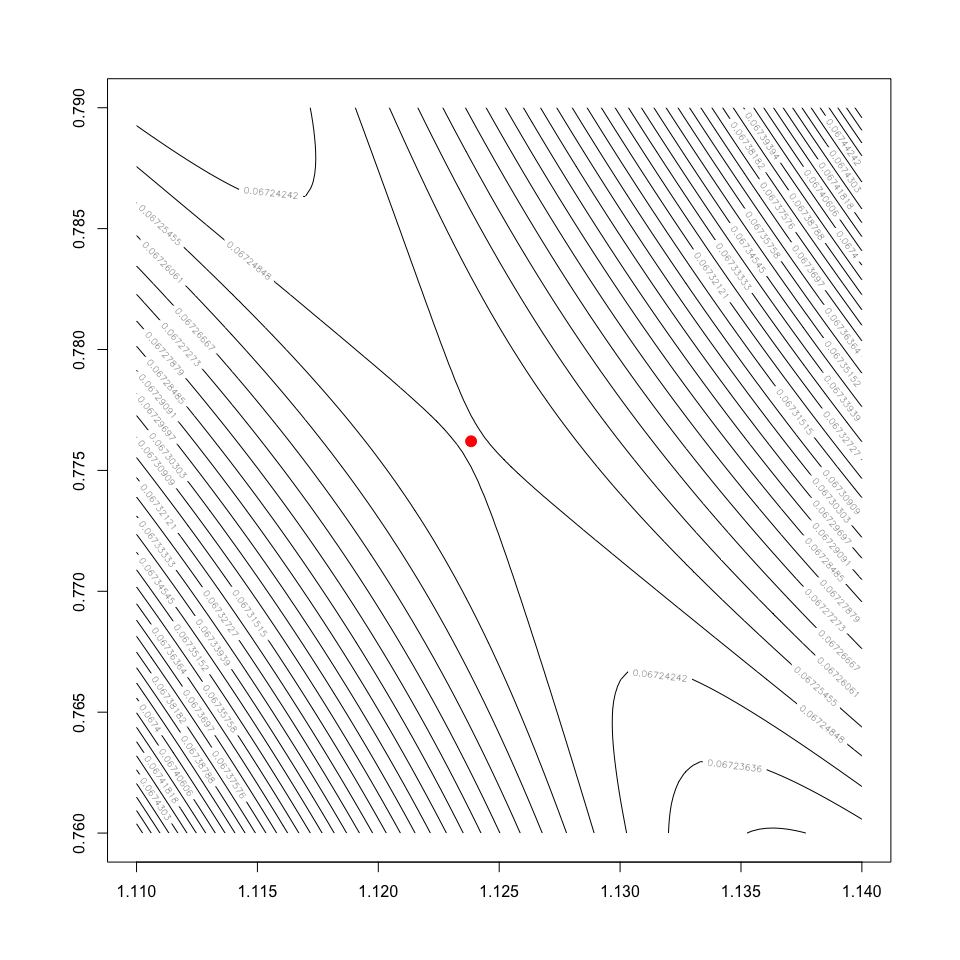

<script type="text/x-mathjax-config">
MathJax.Hub.Config({
  TeX: { equationNumbers: { autoNumber: "AMS" } }
});
</script>


Note: This is a working paper which will be expanded/updated frequently. All suggestions for improvement are welcome, and some would be really benificial. For example, I only use base R graphics, nothing more fancy, because base is all I know. The directory [deleeuwpdx.net/pubfolders/twoPoints](http://deleeuwpdx.net/pubfolders/twoPoints)  has a pdf version, the complete Rmd file with all code chunks, the bib file, and the R source code.

#Theory

In *Multidimensional Scaling (MDS)* we minimize a loss function, called *Kruskal's stress*, which is defined by (@kruskal_64a, @kruskal_64b)
\begin{equation}
\sigma(Z):=\frac12\sum_{i=1}^n\sum_{j=1}^nw_{ij}(\delta_{ij}-d_{ij}(Z))^2\label{E:loss}
\end{equation}
over the $n\times p$ *configurations* $Z$. Here the *weights* $W$ and the *dissimilarities* $\Delta$ are known symmetric, non-negative, and hollow matrices
of numbers. The matrix $D(Z)$ in $\eqref{E:loss}$ has the (Euclidean) *distances* between the $n$ *points* in the configuration.
Thus if $e_i$ are unit vectors, with zeroes everywhere, except for element $i$, which is one, and $A_{ij}:=(e_i-e_j)(e_i-e_j)'$, then
$d_{ij}^2(Z)=\mathbf{tr}\ ZA_{ij}Z'$.

Stress is a complicated function with potentially a large number of local minima and saddle points. In order to study the behavior of stress we shall
look at configurations of the form $Z=\alpha X+\beta Y$, with $X$ and $Y$ known, fixed, and centered configurations. This makes stress a function of the two variables $\alpha$ and $\beta$, and we can use standard contour and perspective plots to study the function. This extends earlier work by @deleeuw_R_93c. We 
assume linear independence, in the sense that $\alpha X+\beta Y=0$ if and only if $\alpha=\beta=0$.

First some simplications. Define the $2\times 2$ matrices
$$
V_{ij}:=\begin{bmatrix}\mathbf{tr}\ XA_{ij}X'&\mathbf{tr}\ XA_{ij}Y'\\\mathbf{tr}\ YA_{ij}X'&\mathbf{tr}\ YA_{ij}Y'\end{bmatrix},
$$
and define $\gamma$ as the vector with elements $\alpha$ and $\beta$. Now
\begin{equation}
\sigma(\gamma)=1-\sum_{i=1}^n\sum_{j=1}^nw_{ij}\delta_{ij}\sqrt{\gamma'V_{ij}\gamma}+\frac12\gamma'V_{\star\star}\gamma,\label{E:gamma}
\end{equation}
where we have assumed for convenience that
$$
\frac12\sum_{i=1}^n\sum_{j=1}^nw_{ij}\delta_{ij}^2=1,
$$
and where
$$
V_{\star\star}:=\sum_{i=1}^n\sum_{j=1}^n w_{ij}V_{ij}.
$$
Note that if all $w_{ij}$ are one, then
$$
V_{\star\star}=2n\begin{bmatrix}X'X&X'Y\\Y'X&Y'Y\end{bmatrix}.
$$

We now make a change of variables, using the Cholesky decomposition $V_{\star\star}=S'S$, with $S$ upper-triangular.  Define $\theta:=S\gamma$ and $U_{ij}:=(S')^{-1}V_{ij}S^{-1}$. Then
\begin{equation}
\sigma(\theta)=1-\sum_{i=1}^n\sum_{j=1}^nw_{ij}\delta_{ij}\sqrt{\theta'U_{ij}\theta}+\frac12\theta'\theta.\label{E:theta}
\end{equation}
In MDS we usually (@deleeuw_C_77) also define the matrix-valued function
\begin{equation}
B(\theta):=\sum_{i=1}^n\sum_{j=1}^nw_{ij}\frac{\delta_{ij}}{d_{ij}(\theta)}U_{ij},\label{E:bdef}
\end{equation}
with $d_{ij}(\theta):=\sqrt{\theta'U_{ij}\theta}$ and the function $\rho(\theta):=\theta'B(\theta)\theta$. Definition $\eqref{E:bdef}$ can be extended using subgradients if $d_{ij}(\theta)=0$ for some $i,j$ (see @deleeuw_C_77). For our purposes we can define $B(\theta)$ more generally by omitting the terms with
$d_{ij}(\theta)=0$. The definition of $\rho$ allows us to write
\begin{equation}
\sigma(\theta)=1-\rho(\theta)+\frac12\theta'\theta.\label{E:short}
\end{equation}
If $d_{ij}(\theta)>0$ for all $i,j$ such that $w_{ij}\delta_{ij}>0$ then stress is differentiable at $\theta$ and  $\mathcal{D}\sigma(\theta)=\theta-B(\theta)\theta$, so that stationary points are defined as solutions of $\theta=B(\theta)\theta$. The more general definition
is $\theta\in\partial\rho(\theta)$. @deleeuw_A_84f shows that stress is always differentiable at local minima.

At a stationary point $\theta$ is an eigenvector of $B(\theta)$ with eigenvalue equal to one. If this is the largest eigenvalue, then $\theta$ actually gives the global minimum of stress (@deleeuw_groenen_mair_E_16e). Also observe that at a stationary point
$\rho(\theta)=\theta'\theta$, and thus $\eqref{E:short}$ implies $\theta'\theta\leq 2$. All stationary values are within a circle or sphere with radius
$\sqrt{2}$.

The `smacof` algorithm (@deleeuw_C_77, @deleeuw_mair_A_09c) is the iterative algorithm
\begin{equation}
\theta^{(k+1)}=B(\theta^{(k)})\theta^{(k)}.
\end{equation}
Note that the algorithm is self-scaling, in the sense that all points on a ray through the origin have the same update. Thus $B(\lambda\theta)(\lambda\theta)=
B(\theta)\theta$ for all $\lambda\not= 0$.

If stress is differentiable at $\theta$ then $\mathcal{D}^2\sigma(\theta)=I-H(\theta)$,
where
\begin{equation}
H(\theta):=\sum_{i=1}^n\sum_{j=1}^nw_{ij}\frac{\delta_{ij}}{d_{ij}(\theta)}\left\{U_{ij}-\frac{U_{ij}\theta\theta'U_{ij}}{\theta'U_{ij}\theta}\right\}.
\end{equation}
Note that $\mathcal{D}\rho(\theta)=B(\theta)\theta$ and $\mathcal{D}^2\rho(\theta)=H(\theta)$. Also note that $H(\lambda\theta)=|\lambda|^{-1}H(\theta)$,
and thus for any $\theta$ there is a $\lambda(\theta)$ such that $\mathcal{D}^2\sigma(\lambda\theta)$ is positive definite for all $\lambda>\lambda(\theta)$.

The `smacof` algorithm convergences to a solution $\theta$ of the stationary equations, with a linear convergence rate equal to the largest eigenvalue of $H(\theta)$
(see @deleeuw_A_88b). 

Note that $\mathcal{D}^2\sigma(\theta)\theta=\theta$, which means that Newton's method takes the form
\begin{equation}
\theta^{(k+1)}=(I-H(\theta^{(k)})^{-1}B(\theta^{(k)})\theta^{(k)}.\label{E:newton}
\end{equation}
Note that Newton is definitely not self-scaling. Equation $\eqref{E:newton}$ also suggest a natural safeguarded version of Newton's method, using
$I-\eta H$, where $0\leq\eta\leq 1$. For $\eta=0$ this is a `smacof` step, for $\eta=1$ this is a Newton step.

On the line through $\theta$ and the origin the function $\sigma$ is a convex quadratic. Thus at every point, except at the origin, there is at least one direction of descent, and consequently stress has only a single local maximum at $\theta=0$, equal to one. In the differentiable case this is also clear from $\mathcal{D}^2\sigma(\theta)\theta=\theta$, which says that the Hessian has at least one positive eigenvalue.

Because stress is an even function, with $\sigma(\theta)=-\sigma(\theta)$ for all $\theta$,  minima come in pairs.

# Example

Our first example has $n=4$, all weights equal to one, and all dissimilarities equal. The same example has been analyzed by @deleeuw_A_88b, @deleeuw_R_93c, @trosset_mathar_97. For this example the global minimum in two dimensions has its four points in the corners of a square. That is our $X$, which has stress 0.02859548. Our $Y$ is another stationary point, which has three points in the corners of an equilateral triangle and the fourth point in the center of the triangle. Its stress is 0.0669873. Another way of looking at the two configurations is that  $X$ are four points equally spaced on a circle, and $Y$ are three points equally spaced on a circle with the fourth point in the center of the circle. @deleeuw_A_88b erroneously claims that $Y$ is a non-isolated local minimum of stress, but @trosset_mathar_97 have shown there exists a descent direction at $Y$, and thus $Y$ is actually a saddle point. Of course the stationary points defined by $X$ and $Y$ are far from unique, because we can distribute the four points over the various corners in many ways. 

The example is chosen in such a way that there are non-zero $\alpha$ and $\beta$ such that $d_{12}(\alpha X+\beta Y)=0$. In fact $d_{12}$ is the only distance that can be made zero by a non-trivial linear combination. 

Note that we have used $\sigma$ for three different functions. The first one with argument $Z$ is defined on *configuration space*, the second one with argument $\gamma$ on *coefficient space*, and the third one with argument $\theta$ also on *coefficient space*. This is a slight abuse of notation, rather innocuous, but we have to keep it in mind. 

From lemma 1we see that $\mathcal{D}\sigma(X)=\mathcal{D}\sigma(Y)=0$ then $\mathcal{D}\sigma(1,0)=\mathcal{D}\sigma(0,1)=0$. Thus stationary points in configuration space are preserved as stationary points in coefficient space, but the reverse implication may not be true. If $\mathcal{D}^2\sigma(X)$ and $\mathcal{D}^2\sigma(Y)$ are positive semi-definite, then so are $\mathcal{D}^2\sigma(1,0)$ and $\mathcal{D}^2\sigma(0,1)$. Thus local minima are preserved. But it is entirely possible that $\mathcal{D}^2\sigma(X)$ and/or $\mathcal{D}^2\sigma(Y)$ are indefinite, and that $\mathcal{D}^2\sigma(1,0)$ and/or $\mathcal{D}^2\sigma(0,1)$ are positive semi-definite. 
Thus saddle points in configuration space can be mapped into local minima in coefficient space. As we will see this actually happens with $Y$, the equilateral triangle with center, in our example.

##Global Pictures


We first make a global perspective plot, over the range $(-2.5,+2.5)$.


<hr>

<center>
Figure  1: Global Perspective
</center>
<hr>

We see the symmetry, following from the fact that stress is even. We also see the local maximum at the origin, where stress is not differentiable. Also note the ridge, where $d_{12}(\theta)=0$ and where stress is not differentiable either.
The ridge shows nicely that on rays emanating from the origin stress is a convex quadratic. Also, far away from the origin, stress globally behaves very much like a convex quadratic (except for the ridge). Clearly local minima must be found in the valleys surrounding the small mountain at the origin, all within the sphere
with radius $\sqrt{2}$.

Figure 2 is a countour plot of stress over $(-2,+2)\otimes(-2,+2)$. The red line is $\{\theta\mid d_{12}(\theta) = 0\}$. The blue line has the minimum of the convex quadratic on each of the rays through the origin. Thus all local minima, and in fact all stationary points, are on the blue line. Note that the plot uses $\theta$ to define the coordinate axes, not $\gamma=(\alpha,\beta)$. Thus there are no stationary points at $(0,1)$ and $(1,0)$, but at the corresponding points (1.3938468501, 0) and (1.040640449, 0.8849253413) in the $\theta$ coordinates (and, of course, at their mirror images).

Besides the single local maximum at the origin, it turns out that in this example there are at least five pairs of stationary points. Or, more precisely, I have not been able to find more than five. Each stationary point $\theta$ has a mirror image $-\theta$. Three of the five are local minima, two are saddle points. Local minima are plotted as blue points, saddle points as red points. 

<hr>

<center>
Figure  2: Global Contour
</center>
<hr>

##First Minimum

We zoom in on the first local minimum at (1.0406404488, 0.8849253415). Its stress is 0.0669872981 and the corresponding configuration is in figure 3.
<hr>

<center>
Figure  3: Configuration First Minimum
</center>
<hr>
Note that this local minimum corresponds with the equilateral triangle with center, which is a saddle point in configuration space (@trosset_mathar_97).
The eigenvalues of $B(\theta)$ are (1.3686346146, 1) and those of the Hessian $I-H(\theta)$ are
(1, 0.0817218104). The area of the contour plot around the stationary value is in figure 4.


<hr>

<center>
Figure  4: Contour Plot First Minimum
</center>
<hr>
##Second Minimum

The second local minimum (which is the global minimum) at (1.3938468501, 0) has stress 0.0285954792 and the corresponding configuration is in figure 5.
<hr>

<center>
Figure  5: Configuration Second Minimum
</center>
<hr>
The eigenvalues of $B(\theta)$ are (1.1362798549, 1) and those of the Hessian $I-H(\theta)$ are
(1, 0.3743105348). The area of the contour plot around the stationary value is in figure 6.


<hr>

<center>
Figure  6: Contour Plot Second Minimum
</center>
<hr>

##Third Minimum

The third local minimum at (0.1096253393, 1.3291941964) has stress 0.1106125366 and the corresponding configuration is in figure 7.
<hr>

<center>
Figure  7: Configuration Third Minimum
</center>
<hr>
The eigenvalues of $B(\theta)$ are (1.5279386438, 1) and those of the Hessian $I-H(\theta)$ are
(1, 0.2362078661). The area of the contour plot around the stationary value is in figure 8.


<hr>

<center>
Figure  8: Contour Plot Third Minimum
</center>
<hr>

##First Saddle Point

The saddle point at (0.3253284471, 1.2916758288) has stress 0.1128674774 and the corresponding configuration is in figure 9.
<hr>

<center>
Figure  9: Configuration First Saddlepoint
</center>
<hr>
The eigenvalues of $B(\theta)$ are (1.7778549251, 1) and those of the Hessian $I-H(\theta)$ are
(1, -0.3110880057). The area of the contour plot around the stationary value is in figure 10.


<hr>

<center>
Figure  10: Contour Plot First Saddlepoint
</center>
<hr>

##Second Saddle Point

The saddle point at (1.1238371005, 0.7762045565) has stress 0.067248329 and the corresponding configuration is in figure 11.
<hr>

<center>
Figure  11: Configuration Second Saddlepoint
</center>
<hr>
The eigenvalues of $B(\theta)$ are (1.4111961819, 1) and those of the Hessian $I-H(\theta)$ are
(1, -0.0841169222). The area of the contour plot around the stationary value is in figure 12.


<hr>

<center>
Figure  12: Contour Plot Second Saddlepoint
</center>
<hr>

#Regions of Attraction

##Smacof

We use the `smacof()` function from the code in the appendix with 100 different starting points of $\theta$, equally spaced on the circle. Figure 13 is a histogram of the number of smacof iterations to convergence within $1e-15$. In all cases `smcof` converges to a local minimum in coefficient space, never to a saddle point.  Figure 14 shows which local minima are reached from the different starting points.  This shows, more or less contrary to what @trosset_mathar_97 suggest, that non-global minima can indeed be points of attraction for `smacof` iterations.


<hr>

<center>
Figure  13: Histogram Number of Smacof Iterations
</center>
<hr>
<hr>

<center>
Figure  14: Path Endpoints of Smacof Iterations
</center>
<hr>

##Newton


We repeat the same exercise with Newton's method, which converges from all 100 starting points. In higher dimensions we may not be so lucky. The histogram of
iteration counts is in figure 15. It shows in this example that `smacof` needs about 10 times the number of iterations that Newton needs. Because `smacof` iterations are much less expensve than Newton ones, this does not really say much about computing times. If we look at figure 16 we see the problem with non-safeguarded Newton. Although we have fast convergence from all 100 starting points, Newton converges to a saddle point in 45 cases.

<hr>

<center>
Figure  15: Histogram Number of Newton Iterations
</center>
<hr>
<hr>

<center>
Figure  16: Path Endpoints of Newton Iterations
</center>
<hr>

#Another Look

Remember that $\rho(\theta)=\theta'B(\theta)\theta$. Thus $\sigma(\lambda\theta)=1-\lambda\rho(\theta)+\frac12\lambda^2\theta'\theta$, and
$$
\min_\lambda\sigma(\lambda\theta)=1-\frac12\frac{\rho^2(\theta)}{\theta'\theta}.
$$
Thus we can minimize $\sigma$ over $\theta$ by maximizing $\rho$ over the unit circle $\mathcal{S}:=\{\theta\mid\theta'\theta=1\}$. This is a nice formulation, because 
$\rho$ is norm, i.e. a homogeneous convex function of $\theta$. Consequently we have transformed the problem from unconstrained minimization of the DC 
function (i.e. difference of convex functions) stress to that of maximization of a ratio of norms. In turn this is equivalent to maximization of the convex function $\rho$ over the unit circle, or, again equivalently, over the unit ball, a compact convex set.  This transform was first used in MDS by @deleeuw_C_77, partly because it made the theory developed by @robert_67 available.

The levels sets $\{\theta\mid\rho(\theta)=\kappa\}$ are the $\rho$-circles defined by the norm $\rho$. The corresponding $\rho$-balls $\{\theta\mid\rho(\theta)\leq\kappa\}$ are closed and nested convex sets containing the origin. Thus we want to find the largest $\rho$-circle that
still intersects $\mathcal{S}$. The similarity with the geometry of eigenvalue problems is obvious.


In our example we know that the global optimum of stress is at (1.3938468501, 0), and if we project that point on the circle it becomes (1, 0). The corresponding optimal $\rho$ is 1.3938468501. Figure 17 gives the contourplot for $\rho$, with the outer $\rho$-circle corresponding with the optimal value. The fact that the optimal value contour is disjoint from the interior of $\mathcal{S}$ is necessary and sufficient for global optimality (@dur_horst_locatelli_98). Notice the sharp corners in the contour plot, showing the non-diffentiability of $\rho$ at the points
where $d_{12}(\theta)=0$. We could also look for the minimum of $\rho$ on the unit circle, which means finding the largest $\rho$-circle that touches
$\mathcal{S}$ on the inside. Inspecting figure 17 shows that this will be a point where $\rho$ is not
differentiable, i.e. a point with $d_{12}(\theta)=0$. This minimum $\rho$ problem does not make much sense in the context of multidimensional scaling,
however, and it not related directly to the minimization of stress.


<hr>

<center>
Figure  17: Contour Plot for Rho
</center>
<hr>

#A Final Look

Now that we know that the MDS problem is equivalent to maximizing $\rho$ on the unit circle, we can use nonlinear coordinates $(\theta_1,\theta_2)=(\sin\xi,\cos\xi)$ to reduce the problem to a one-dimensional unconstrained one in, say, ``circle space''. Thus, with the same abuse of notation as for stress, $\rho(\xi):=\rho(\sin\xi,\cos\xi)$, and we have to maximize $\rho$ over $0\leq\xi\leq\pi$. 

In figure 18 we have plotted $\rho$ as a function of $\eta$. There are blue vertical lines at the three local minima in coefficient space,
red vertical lines at the stationary points, and a green vertical line where $d_{12}(\xi)=0$. Note that in circle space stress has both multiple local minima and multiple local maxima.
<hr>


<center>
Figure  18: One-dimensional Rho
</center>
<hr>


From lemma 2 we see that the second derivative $\mathcal{D}^2\rho(\xi)$ is equal to $\mathbf{tr}\ H(\xi)-\rho(\xi)$.
For the three local minima in coordinate space we find second derivatives -0.111634069, -0.5217315599, -0.3150321345 in circle space, i.e. they are properly converted to local maxima. The two stationary points in coordinate space have second derivatives 0.4143740166, 0.1148897778, and are turned into local minima.

For more general cases, with a basis of $n$ configurations, we know from @lyusternik-schnirelmann_34 that a continuously differentiable even function on the unit sphere in $\mathbb{R}^n$ has at least $n$ distinct pairs of stationary points.

#Discussion

Although our results are based on a single small example, there are some general conclusions we can draw.

Stess has no local maxima, except one at the origin. It has saddle points and non-global minima. If we reparametrize configuration space by using linear combinations of a fixed number of configurations we can ``upgrade'' some of the stationary point to local minima. If we remove homogeneity from the problem by working on the unit ball that can upgrade even more stationary points.

In comparing `smacof` with Newton we have found, not surprisingly, that Newton uses fewer iterations but often converges to saddle points. 


The finding that saddle points in configuration space can correspond with local minima in coefficient space has an interesting implication for the `smacof` algorithm. We know that the set of starting points from which `smacof` converges to a saddle point has measure zero, in other words unless you start in a saddle point, you will almost certainly converge to a local minimum (@lee_simchowitz_jordan_recht_16). 

To illustrate this we repeat a calculation done first in @deleeuw_A_88b. Suppose we start `smacof` iterations with the 
$Y+.001*E$, where $E$ are random standard normals, and $Y$ is the triangle with center (which has loss function value 0.0669872981). `smacof` starts with a loss function value for the perturbed $Y$ of 0.066987868. It does not drop below 0.066 until iteration 1346. But then it rather quickly converges in iteration 1388 to 0.0285954792, the loss function value of the global minimum, four points in the corners of a square. On the other hand, if we minimize $\sigma(\gamma)$  over $\gamma$ we have a non-zero probability of converging to the local minimum in coefficient space at $(0,1)$, i.e. to $Y$.

This indicates, perhaps, that `smacof` must be used with a somewhat higher precision than the default, and that testing for second derivative information is always a good idea, no matter what space we are working in.

Minimizing stress over a plane spanned by two configurations may seem somewhat artificial and limited. But think of the situation in which we use configurations $X$ and $Y=\mathcal{D}\sigma(X)$. Or, equivalently, $X$ and $B(X)X$. In that case minimizing over the plane means computing the optimal step size of a gradient step or the optimum over-relaxation of `smacof` iterations, a problem first addressed perhaps in @deleeuw_heiser_C_80. Or the case in which $Y$ is the Newton step, and optimizing over the plane is a stabilized version of Newton's method.

#Appendix: Two Lemmas

Here we present two lemmas that describe the change of coordinates from configuration space to coefficient space and then to circle space. The proofs, which are just simple computations, are omitted.
<hr>
**Lemma  1: [On the Line]** Suppose $X$ and Y are $n\times m$ matrices and $f$ is a twice-differentiable function on $\mathbb{R}^{n\times m}$. Define $g(\alpha,\beta):=f(\alpha X+\beta Y)$. Then
$$
\mathcal{D}g(\alpha,\beta)=\begin{bmatrix}\mathbf{tr}\ X'\mathcal{D}f(\alpha X+\beta Y)\\
\mathbf{tr}\ Y'\mathcal{D}f(\alpha X+\beta Y)\end{bmatrix},
$$
and
$$
\mathcal{D}^2g(\alpha,\beta)=
\begin{bmatrix}
\sum_{i=1}^n\sum_{j=1}^m\sum_{k=1}^n\sum_{\ell=1}^m x_{ij}x_{k\ell}\frac{\partial f^2}{\partial z_{ij}\partial z_{k\ell}}(\alpha X+\beta Y)&
\sum_{i=1}^n\sum_{j=1}^m\sum_{k=1}^n\sum_{\ell=1}^m x_{ij}y_{k\ell}\frac{\partial f^2}{\partial z_{ij}\partial z_{k\ell}}(\alpha X+\beta Y)\\
\sum_{i=1}^n\sum_{j=1}^m\sum_{k=1}^n\sum_{\ell=1}^m y_{ij}x_{k\ell}\frac{\partial f^2}{\partial z_{ij}\partial z_{k\ell}}(\alpha X+\beta Y)&
\sum_{i=1}^n\sum_{j=1}^m\sum_{k=1}^n\sum_{\ell=1}^m y_{ij}y_{k\ell}\frac{\partial f^2}{\partial z_{ij}\partial z_{k\ell}}(\alpha X+\beta Y)
\end{bmatrix}.
$$
<hr>
It is clear how this result generalizes to linear combinations of more than two matrices.
<hr>
**Lemma  2: [On the Circle]** If $f$ is a twice-differentiable function of two variables and $g(x)=f(sin(x),cos(x))$ then
$$
\mathcal{D}g(x)=y'\mathcal{D}f(z),
$$ 
with $z:=(sin(x),cos(x))$ and $y:=(cos(x),-sin(x))$, and
$$
\mathcal{D}^2g(x)=y'\mathcal{D}^2f(z)y-z'\mathcal{D}f(z).
$$
<hr>
More generally, if a differentiable function $f$ on the unit sphere has a stationary point at $\theta$ then $\theta'\theta=1$ and there is a multiplier $\lambda$ such that $\mathcal{D}f(\theta)=\lambda\theta$. If $f$ is homogeneous of degree one then $\theta'\mathcal{D}f(\theta)=f(\theta)$ and thus at a stationary point $\lambda=f(\theta)$. If the function is twice differentiable and the stationary point is a local maximum then in addition $\nu'\mathcal{D}^2f(\theta)\nu\leq\lambda$ for all $\nu'\nu=1$ and $\nu'\theta=0$. For a norm, i.e. a homogeneous convex $f$, this says equivalently that the largest eigenvalue of $\mathcal{D}^2f(\theta)$ is less than or equal to $f(\theta)$. Note that the second order necessary conditions for a local maximum become sufficient if the inequality is strict.


#Appendix: Code


```r
bmat <- function (a, b, x, y, delta) {
  bm <- matrix (0, 2, 2)
  hm <- matrix (0, 2, 2)
  z <- c(a, b)
  for (i in 1:4) {
    for (j in 1:4) {
      if (i == j) next
      uij <- uu (i, j, x, y)
      uz <- drop (uij %*% z)
      dij <- sqrt (sum (uij * outer (z, z)))
      bm <- bm + (delta[i,j] / dij) * uij
      hm <- hm + (delta[i,j] / dij) * (uij - outer (uz, uz) / sum (z * uz))
    }
  }
  return (list (b = bm, h = hm))
}

stress <- function (a, b, x, y, delta) {
  z <- c (a, b)
  bm <- bmat (a, b, x, y, delta)$b
  return (1 + sum(z ^ 2) / 2 - sum (z * bm %*% z))
}

rho <- function (a, b, x, y, delta) {
  z <- c (a, b)
  bm <- bmat (a, b, x, y, delta)$b
  return (sum (z * bm %*% z))
}

vv <- function (i, j, x, y) {
  a <- matrix (0, 2, 2)
  a[1, 1] <- sum ((x[i, ]- x[j,]) ^ 2)
  a[2, 2] <- sum ((y[i, ]- y[j,]) ^ 2)
  a[1, 2] <- a[2, 1] <- sum ((x[i, ]- x[j,]) * (y[i, ]- y[j, ]))
  return (a)
}

uu <- function (i, j, x, y) {
  n <- nrow (x)
  asum <- 2 * n * matrix (c (sum(x ^ 2), sum (x * y), sum (x * y), sum (y ^ 2)), 2, 2)
  csum <- solve (chol (asum))
  return (t(csum) %*% vv (i, j, x, y) %*% csum)
}

smacof <- function (a, b, x, y, delta, eps = 1e-10, itmax = 1000, verbose = TRUE) {
  zold <- c(a,b)
  bold <- bmat (a, b, x, y, delta)$b
  fold <- 1 + sum(zold ^ 2) / 2 - sum (zold * bold %*% zold)
  itel <- 1
  repeat {
    znew <- drop (bold %*% zold)
    bhmt <- bmat (znew[1], znew[2], x, y, delta)
    bnew <- bhmt$b
    fnew <- 1 + sum(znew ^ 2) / 2 - sum (znew * bnew %*% znew)
    if (verbose) {
      cat (
        formatC (itel, width = 4, format = "d"),
        formatC (
          fold,
          digits = 10,
          width = 13,
          format = "f"
        ),
        formatC (
          fnew,
          digits = 10,
          width = 13,
          format = "f"
        ),
        "\n"
      )
    }
    if ((itel == itmax) || (fold - fnew) < eps)
      break ()
    itel <- itel + 1
    fold <- fnew
    zold <- znew
    bold <- bnew
  }
  return (list (stress = fnew, theta = znew, itel= itel, b = bnew, g = znew - bnew %*% znew, h = diag(2) - bhmt$h))
}


newton <- function (a, b, x, y, delta, eps = 1e-10, itmax = 1000, verbose = TRUE) {
  zold <- c(a,b)
  bhmt <- bmat (a, b, x, y, delta)
  bold <- bhmt$b
  hold <- diag(2) - bhmt$h
  fold <- 1 + sum(zold ^ 2) / 2 - sum (zold * bold %*% zold)
  itel <- 1
  repeat {
    znew <- drop (solve (hold, bold %*% zold))
    bhmt <- bmat (znew[1], znew[2], x, y, delta)
    bnew <- bhmt$b
    hnew <- diag(nrow(bnew)) - bhmt$h
    fnew <- 1 + sum(znew ^ 2) / 2 - sum (znew * bnew %*% znew)
    if (verbose) {
      cat (
        formatC (itel, width = 4, format = "d"),
        formatC (
          fold,
          digits = 10,
          width = 13,
          format = "f"
        ),
        formatC (
          fnew,
          digits = 10,
          width = 13,
          format = "f"
        ),
        "\n"
      )
    }
    if ((itel == itmax) || abs (fold - fnew) < eps)
      break ()
    itel <- itel + 1
    fold <- fnew
    zold <- znew
    bold <- bnew
    hold <- hnew
  }
  return (list (stress = fnew, theta = znew, itel = itel, b = bnew, g = znew - bnew %*% znew, h = hnew))
}

mprint <- function (x, d = 2, w = 5) {
  print (noquote (formatC (x, di = d, wi = w, fo = "f")))
}
```

#References
